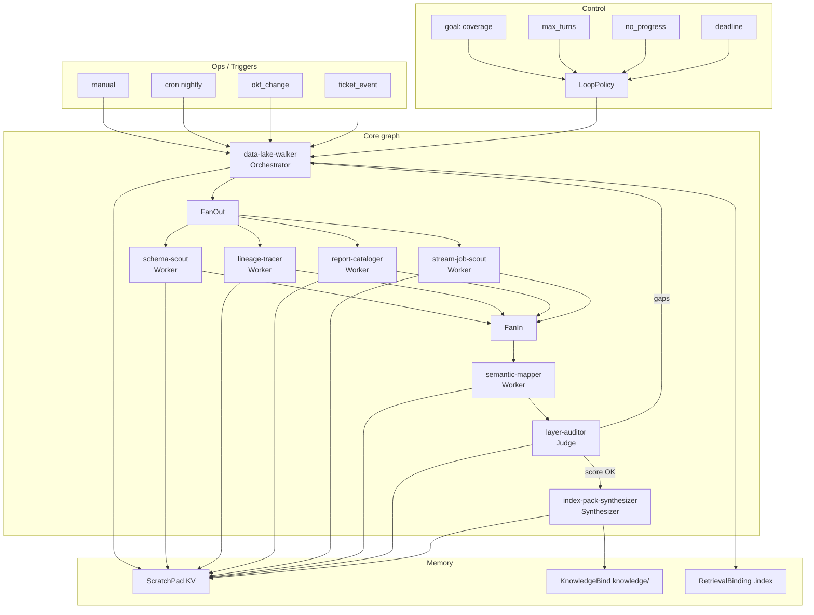
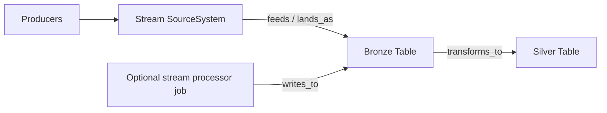
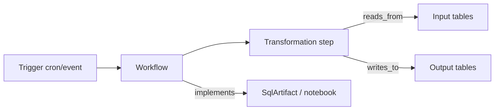
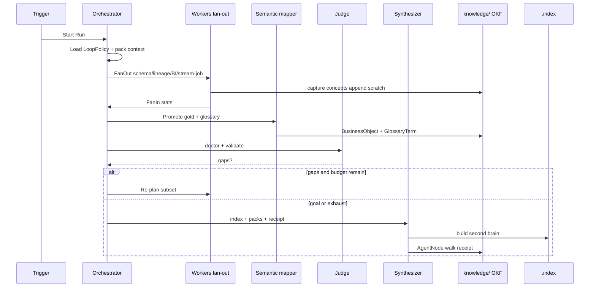

# DEKC design document

**Data Engineering Knowledge Capture (DEKC)** — how knowledge is stored, how multi-agent **loops and graphs** reverse-engineer platforms, and how **Azure Fabric / AWS / GCP** (including **streams and jobs**) map into one OKF second brain.

Related systems:

| System | Role | Repo |
|--------|------|------|
| OKF graph engineering | Portable knowledge graph ops | [okf-plugin](https://github.com/SpillwaveSolutions/okf-plugin) |
| AGER | Multi-agent loop schema (Orchestrator/Worker/Judge, LoopPolicy, ScratchPad, Tools, Triggers) | [okf-agent-graph](https://github.com/SpillwaveSolutions/okf-agent-graph) |
| PKC | Project reasoning capture | [project-knowledge-capture](https://github.com/SpillwaveSolutions/project-knowledge-capture) |
| DEKC | Data-domain catalogs + walk scripts + agents | this repo |

AGER spec version referenced: **0.3.0** ([AGER_SPEC](https://github.com/SpillwaveSolutions/okf-agent-graph/blob/main/docs/AGER_SPEC.md)). DEKC plugin **0.1.0**.

---

## 1. Goals and non-goals

### Goals

1. Represent **technical data assets** (schemas, tables, views, queries, SQL/DAX, contracts) as OKF concepts.
2. Represent **flow**: medallion layers, transformations, workflows/jobs, streams, lineage paths.
3. Represent **business meaning**: business objects, glossary, metrics, semantic models, dashboards.
4. Drive discovery with an **AGER-shaped multi-agent loop** that is resumable, budgeted, and auditable.
5. Reverse-engineer **typical** Azure Fabric, AWS, and GCP topologies into the same catalogs.
6. Index results for LLM retrieval (second brain) without proprietary lock-in.

### Non-goals

- Replacing cloud control planes (Fabric, Glue, Dataflow consoles).
- Real-time CDC engines or query execution.
- Guaranteeing 100% automated business definitions (humans/agents refine glossary).
- Replacing AGER as the general multi-agent schema — DEKC **uses** AGER patterns; it does not fork them.

---

## 2. Knowledge model

### 2.1 Storage

Every concept is OKF Markdown:

```yaml
---
type: Table
title: orders
description: Cleaned orders
layer: silver
tags: [table, dekc, silver]
timestamp: 2026-08-09T00:00:00Z
status: active
verified: true
links:
  - target: /layers/silver.md
    rel: layered_as
  - target: /tables/bronze-orders-raw.md
    rel: derived_from
---
```

Absolute in-bundle links + optional `links[].rel`. See [typed-edges.md](../typed-edges.md).

### 2.2 Catalogs

`sources` · `layers` · `schemas` · `tables` · `views` · `queries` · `columns` · `sql` · `dax` · `transformations` · `workflows` · `lineage` · `contracts` · `semantic` · `metrics` · `reports` · `dashboards` · `business-objects` · `glossary` · `packs` · `agents`

**Streams** are modeled as:

- `SourceSystem` with `source_kind: stream` (or `kind: stream` in capture CLI)
- optional landing `Table` (usually bronze)
- `LineagePath` / edges `feeds` | `lands_as` | `writes_to`

**Jobs** are modeled as:

- `Workflow` (orchestrator: airflow | adf | glue | dataflow | fabric-pipeline | composer | stepfunctions | …)
- `Transformation` (from_layer → to_layer, SQL body when known)
- edges `reads_from` / `writes_to` / `transforms_to` / `promotes_to`

### 2.3 Second-brain index

After walks, `dekc_index.py` materializes:

| File | Role |
|------|------|
| `.index/inventory.json` | Concept cards |
| `.index/search.json` | Inverted token index |
| `.index/graph.json` | Lineage adjacency |
| `.index/embeddings.jsonl` | Local bag-of-tokens vectors |
| `.index/manifest.json` | Build metadata |

Agents retrieve via `dekc_search` / `dekc_pack` / OKF pack (2-hop default).

---

## 3. Agent loop / graph logic (AGER)

This section reverse-engineers DEKC walks against [okf-agent-graph](https://github.com/SpillwaveSolutions/okf-agent-graph) (AGER v0.3): **config, not framework** — the same graph can adapt to Claude subagents, LangGraph, CrewAI, etc.

### 3.1 Four planes (AGER) applied to DEKC

| Plane | AGER types | DEKC mapping |
|-------|------------|--------------|
| **Core** | OrchestratorAgent, WorkerAgent, JudgeAgent, SynthesizerAgent, FanOut/FanIn, AgentGraph | `data-lake-walker` + scouts + `layer-auditor` + index/pack writer |
| **Control** | LoopPolicy, LoopControl (goal, deadline, price, max_turns, no_progress) | Coverage goals, turn caps, stall detection |
| **Memory** | ScratchPad KV, LineageRecord, KnowledgeBind, RetrievalBinding | Scratch keys for discoveries; KnowledgeBind → `knowledge/`; RetrievalBinding → `.index` + packs |
| **Ops** | Tool, ToolRule, Run, Trigger, FailurePolicy, RetryPolicy | `dekc_walk` / capture / lineage tools; cron/manual/okf_change triggers |

### 3.2 Canonical DEKC AgentGraph



### 3.3 Roles and responsibilities

| Role | DEKC agent | Responsibilities | Output mode (AGER) |
|------|------------|------------------|--------------------|
| **Orchestrator** | data-lake-walker | Inventory sources, choose fan-out plan, re-plan after judge gaps, enforce budgets | plan + spawn list |
| **Worker** | schema-scout | Schemas, tables, columns, contracts | **append** to `scratch.schema_findings` |
| **Worker** | lineage-tracer | SQL/job edges, LineagePath, Transformation, mermaid | **append** to `scratch.lineage_edges` |
| **Worker** | report-cataloger | Dashboards, reports, DAX, semantic bindings | **append** to `scratch.bi_assets` |
| **Worker** | stream-job-scout *(logical; may be walker skill path)* | Streams, pipelines, schedules, landing tables | **append** to `scratch.landing_flows` |
| **Worker** | semantic-mapper | BusinessObject + GlossaryTerm + Metric links | **append** to `scratch.business_objects` |
| **Judge** | layer-auditor | Score coverage, orphans, missing promotions, index freshness | judgment + gap list |
| **Synthesizer** | index + pack step | `dekc_index build`, context packs, walk AgentNode receipt | set final artifacts |

Parallel workers **must append** (AGER invariant) so concurrent scouts do not clobber each other.

### 3.4 LoopPolicy (normative defaults for lake walks)

Check order (AGER): **goal → deadline → price → max_turns → no_progress**.

| Control | Default intent for DEKC |
|---------|-------------------------|
| **goal** | “All discovered gold tables have ≥1 business object OR explicit skip; lineage path exists for revenue-critical tables; index rebuilt.” |
| **deadline** | Wall-clock for automated runs (e.g. 30–60 min nightly) |
| **price_budget** | Optional LLM/API budget when using embed APIs |
| **max_turns** | Orchestrator re-plan cycles (e.g. 8) |
| **no_progress** | Exit if two consecutive turns add 0 concepts and 0 edges |

On exhaust: write partial AgentNode receipt + doctor report; do not invent edges to “finish.”

On goal: synthesizer runs index + optional release digest.

### 3.5 ScratchPad keys

| Key | Mode | Contents |
|-----|------|----------|
| `sources` | set | Registered SourceSystems |
| `schema_findings` | append | Table/view/column paths |
| `lineage_edges` | append | (up, down, rel) tuples |
| `landing_flows` | append | stream/job → bronze mappings |
| `bi_assets` | append | dashboard/report/metric paths |
| `business_objects` | append | BO + glossary paths |
| `gaps` | set | Judge gap list for re-plan |
| `stats` | set | created/updated/skipped counts |

ScratchPad holds **salient KV**, not full transcripts (AGER principle). Full text lives in OKF concept files under KnowledgeBind.

### 3.6 Tools (ops plane)

| Tool | Idempotent | Notes |
|------|------------|-------|
| `dekc_walk` | yes (stable paths) | Filesystem reverse engineer |
| `dekc_capture.*` | yes | Concept writers |
| `dekc_lineage.*` | yes | Graph ops |
| `dekc_business.promote*` | yes | BO + glossary |
| `dekc_index.build` | yes | Second brain |
| `dekc_validate` / `dekc_doctor` | yes | Quality gates |
| Cloud read APIs (future) | per-API | SecretRef only; ToolRule block without readonly scope |

**ToolRule examples:** block writes outside `knowledge/`; require human for irreversible deletes; rewrite paths to bundle-absolute form.

### 3.7 Run / Trigger

| Trigger kind | When |
|--------------|------|
| `manual` | Engineer or agent invoked `/dekc-walk` |
| `cron` | Nightly coverage walk |
| `okf_change` | SQL model PR merged → re-walk subset |
| `ticket_event` | WikiTicket / worklog “document this pipeline” |

Each Run writes/updates `agents/walk-<source>.md` (AgentNode receipt) with stats.

### 3.8 Failure, retry, compensation

| Error class | Policy |
|-------------|--------|
| Transient I/O | RetryPolicy exponential backoff |
| Parse failure on one SQL file | Skip file, append to gaps, continue |
| Validation errors after write | Stop synthesizer success path; orchestrator may fix links |
| Secret detected in body | Scrub + flag; never commit raw |

Compensation is rare (knowledge is additive); “undo” = revert Git commit of knowledge bundle.

### 3.9 Progressive disclosure during the loop

Orchestrator and workers load **2-hop packs** (~20 nodes) via RetrievalBinding, not the full lake graph. Judge sees doctor JSON + gap list only. This matches OKF progressive disclosure and AGER ContextIsolationPolicy for subagents.

### 3.10 Optional formal AGER bundle

Teams can author an explicit AGER bundle (via `/ager-init`) that **KnowledgeBinds** the DEKC `knowledge/` root and **uses** DEKC scripts as Tools. DEKC agents remain usable without that bundle; the AGER bundle is the portable runtime config for LangGraph/CrewAI adapters.

```text
agent-graph/          # AGER (okf-agent-graph)
  agents/data-lake-walker.md
  runtime/loop-policy.md
  tools/dekc-walk.md
  memory/knowledge-bind-dekc.md  → /knowledge or sibling path

knowledge/            # DEKC OKF data graph
  tables/ ...
```

---

## 4. Reverse-engineering cloud platforms

Principle: **mirror or export → walk → specialize workers → promote → index**. Cloud-native APIs are optional Tool adapters; the OKF graph is the contract.

### 4.1 Shared reverse-engineering algorithm

```text
1. Identify control plane + storage plane + compute plane + serve plane
2. Export or mirror artifacts into a local tree (or mount readonly)
3. Register SourceSystem(s) per plane entrypoint
4. Fan-out:
   a. schema-scout → structural catalogs
   b. stream-job-scout → landing producers
   c. lineage-tracer → edges across jobs/SQL
   d. report-cataloger → serve plane
5. semantic-mapper → gold/curated → business objects
6. layer-auditor → score + gaps
7. synthesizer → index + packs + receipt
```

### 4.2 Azure Fabric (typical setup)

#### Topology (reference)

```text
                    ┌──────────────┐
   SaaS / IoT ───►  │ Event Hubs / │
   Apps        ───►  │ Eventstream  │──stream──► Bronze Lakehouse / Eventhouse
                    └──────────────┘
   On-prem / SaaS ─► Data Pipeline / Data Factory Copy ──job──► Bronze files/tables
                              │
                              ▼
                    Silver Lakehouse / Warehouse  (notebooks, Spark jobs, T-SQL)
                              │
                              ▼
                    Gold Lakehouse / Warehouse marts
                              │
              ┌───────────────┼────────────────┐
              ▼               ▼                ▼
      Semantic model     Power BI          Data Activator
      (measures/DAX)     reports/dash      alerts
```

#### Artifact mirror (what to walk)

| Artifact | DEKC target |
|----------|-------------|
| Lakehouse tables / shortcuts | Table + layer + schema |
| Warehouse DDL / views | Table / View / SqlArtifact |
| Spark / T-SQL notebooks | Query + Transformation |
| Data Pipelines / ADF JSON | Workflow + job steps |
| Eventstream / Event Hub defs | SourceSystem `stream` + landing lineage |
| Semantic models / DAX | SemanticModel + DaxArtifact + Metric |
| Power BI reports | Report / Dashboard |
| Dataflow gen2 | Transformation |

#### Agent emphasis

- **stream-job-scout**: Eventstream → bronze table `lands_as`
- **lineage-tracer**: pipeline activities + notebook SQL
- **report-cataloger**: semantic model + DAX + report bindings
- **semantic-mapper**: gold Warehouse tables and certified datasets

#### Example edges

```text
SourceSystem:eventhub-orders --feeds--> Table:bronze-orders-raw
Workflow:fabric-pipeline-orders --writes_to--> Table:bronze-orders-raw
Transformation:cleanse-orders --reads_from--> bronze-orders-raw
Transformation:cleanse-orders --writes_to--> silver-orders
Table:silver-orders --promotes_to--> Table:gold-order-daily
SemanticModel:retail --models--> gold-order-daily
Dashboard:exec-revenue --visualizes--> Metric:gmv
BusinessObject:Daily Order Summary --derived_from--> gold-order-daily
```

### 4.3 AWS (typical setup)

#### Topology (reference)

```text
   Producers ──► Kinesis / MSK ──Firehose──► s3://lake/raw|bronze/...
        │                                      │
        │         Glue / Lambda / EMR jobs     │
        └──────────── batch ───────────────────┤
                                               ▼
                                    Glue Catalog + Iceberg/Hive
                                    silver/ and gold/ prefixes
                                               │
                    Athena / Redshift Spectrum / Redshift
                                               │
                                    QuickSight / external BI
```

Also common: **AppFlow / DMS** → bronze; **Step Functions** or **MWAA** orchestration; **Lake Formation** permissions (document as contracts / owns edges, not secrets).

#### Artifact mirror

| Artifact | DEKC target |
|----------|-------------|
| S3 prefixes `bronze/…`, `silver/…`, `gold/…` | Layered Table/Dataset |
| Glue Catalog JSON / Athena `SHOW CREATE` | Schema + Table + Column |
| Glue job scripts (PySpark/Scala) | Workflow + Transformation + SQL/code refs |
| MWAA DAGs / Step Functions ASL | Workflow steps |
| Kinesis/Firehose configs | SourceSystem stream + landing path |
| QuickSight datasets/dashboards | Semantic-ish + Dashboard |
| dbt on Athena/Redshift | Query + lineage |

#### Agent emphasis

- **schema-scout**: Glue Catalog is system of record for tables
- **stream-job-scout**: Firehose delivery streams → S3 raw
- **lineage-tracer**: Glue job scripts + dbt `ref()` if present
- **layer-auditor**: gold without BO; bronze without upstream stream/job

### 4.4 GCP (typical setup)

#### Topology (reference)

```text
   Apps ──► Pub/Sub ──► Dataflow streaming ──► BigQuery landing / GCS raw
   Files ──► GCS ──► Dataflow / Dataproc / scheduled load jobs ──► BQ
                                      │
                                      ▼
                         BigQuery silver datasets (views + tables)
                                      │
                                      ▼
                         mart / gold datasets + authorized views
                                      │
                         Looker / Looker Studio / Connected Sheets
```

Also common: **Dataform** or **dbt** on BQ; **Cloud Composer** (Airflow); **Cloud Scheduler** triggers; **BigLake** external tables on GCS.

#### Artifact mirror

| Artifact | DEKC target |
|----------|-------------|
| BQ DDL / INFORMATION_SCHEMA export | Schema + Table + View + Column |
| Dataform/dbt SQL tree | Query + Transformation + lineage |
| Dataflow templates / jobs | Workflow (streaming or batch) |
| Pub/Sub topics/subscriptions | SourceSystem stream |
| Composer DAGs | Workflow |
| Looker views/explores (export) | SemanticModel + Metric + Dashboard |

#### Agent emphasis

- **stream-job-scout**: Pub/Sub → Dataflow → BQ landing
- **lineage-tracer**: Dataform dependency graph is high-signal
- **semantic-mapper**: mart datasets and Looker explores → BO + glossary
- **report-cataloger**: Looker Studio / Looker boards

### 4.5 Cross-cloud comparison (landing & jobs)

| Concern | Azure Fabric | AWS | GCP |
|---------|--------------|-----|-----|
| **Object storage** | OneLake / ADLS | S3 | GCS |
| **Table catalog** | Lakehouse + Warehouse | Glue Catalog | BigQuery catalog |
| **Stream land** | Eventstream / Event Hubs | Kinesis + Firehose | Pub/Sub + Dataflow |
| **Batch job** | Pipelines / Notebooks / ADF | Glue / EMR / Step Functions | Dataflow / Dataproc / Composer |
| **Orchestration** | Fabric pipelines / ADF / Airflow | MWAA / Step Functions | Composer / Workflows |
| **Serve / BI** | Power BI + semantic model | QuickSight / external | Looker / Studio |
| **Medallion folders** | lh_bronze/silver/gold or warehouse schemas | s3 prefixes + DBs | BQ datasets `raw/stg/mart` |

DEKC normalizes all of these into **SourceSystem · Layer · Table · Workflow · Transformation · LineagePath · Semantic* · BusinessObject**.

---

## 5. Streams and jobs in depth

### 5.1 Stream landing pattern



Capture checklist:

1. **SourceSystem** — name, `kind: stream`, URI (namespace/topic/hub), description  
2. **Landing Table** — layer bronze, schema, columns if known  
3. **Processor job** (if any) — Workflow + Transformation  
4. **LineagePath** — stream → bronze → silver…  
5. Tags: `stream`, `landing`, cloud label (`azure`|`aws`|`gcp`)

### 5.2 Job / pipeline pattern



Job metadata to preserve in frontmatter or body:

- orchestrator / runtime
- schedule
- input/output FQNs
- SLA / freshness expectations (optional DataContract)
- owner team

### 5.3 Micro-batch vs continuous

| Mode | Modeling |
|------|----------|
| Continuous stream | SourceSystem stream + always-on Workflow `tags: [streaming]` |
| Micro-batch (e.g. Firehose 60s) | Stream source + Workflow with schedule note |
| Nightly batch | Workflow only; no stream source required |
| Hybrid | Stream into bronze + batch job silver/gold (two edges from bronze) |

---

## 6. Business materialization

Technical completeness is not product value. After structure + lineage:

1. Prefer **gold / mart** tables and certified semantic metrics.
2. `dekc_business.promote` creates **BusinessObject** + **GlossaryTerm**.
3. Edges: BO `derived_from` table; table `businessizes` BO; glossary `glosses` BO.
4. Metrics `measures` BO; dashboards `visualizes` metrics/tables.

Judge (**layer-auditor**) treats `business_coverage = BO_count / table_count` (especially gold) as a first-class score.

---

## 7. End-to-end walk sequence



---

## 8. Implementation map (this repo)

| Component | Path |
|-----------|------|
| Shared OKF writers | `scripts/dekc_common.py` |
| Capture | `scripts/dekc_capture.py` |
| Walk | `scripts/dekc_walk.py` |
| Lineage | `scripts/dekc_lineage.py` |
| Business promote | `scripts/dekc_business.py` |
| Index / search | `scripts/dekc_index.py`, `dekc_search.py` |
| Packs / doctor / validate | `dekc_pack.py`, `dekc_doctor.py`, `dekc_validate.py` |
| Agents | `agents/*.md` |
| Skills / commands | `skills/`, `commands/` |
| Sample | `sample-knowledge/` |
| Explorer UI | `src/components/dekc-explorer.tsx` |

---

## 9. Load-bearing invariants

1. **Never invent lineage** — only SQL, job config, or explicit user input.  
2. **Idempotent paths** — same FQN/layer → same file path (slugify stable).  
3. **OKF absolute links** — targets like `/tables/…`.  
4. **Outbound edges for packs** — write inverse edges when needed (`businessizes`, `verified_by`-style patterns).  
5. **Scrub secrets/PII** on capture.  
6. **Parallel workers append** to ScratchPad lists (AGER).  
7. **Judge before claiming done** — doctor + validate.  
8. **Index after structural change** — second brain freshness.

---

## 10. Roadmap (design intent)

| Horizon | Intent |
|---------|--------|
| Now (0.1) | Filesystem walk, capture, lineage, BO/glossary, index, multi-host plugin, sample retail lake |
| Next | First-class `Stream` / `Job` types (or stabilized tags), cloud export recipes as skills, AGER sample graph bundle for DEKC |
| Later | Readonly cloud API tools (SecretRef), contract tests per cloud mirror, embed API optional vectors |

---

## 11. References

- [AGER Specification](https://github.com/SpillwaveSolutions/okf-agent-graph/blob/main/docs/AGER_SPEC.md)
- [AGER design doc](https://github.com/SpillwaveSolutions/okf-agent-graph/blob/main/docs/designs/current_design_doc.md)
- [AGER user guide](https://github.com/SpillwaveSolutions/okf-agent-graph/blob/main/docs/user_guide/user-guide.md)
- [OKF plugin](https://github.com/SpillwaveSolutions/okf-plugin)
- [PKC](https://github.com/SpillwaveSolutions/project-knowledge-capture)
- [DEKC user guide](../user_guide/user-guide.md)
- [Typed edges](../typed-edges.md)
