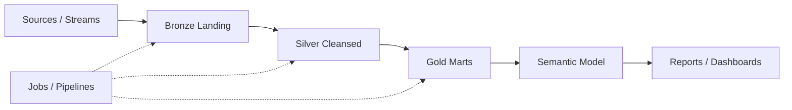

# Commerce lake architecture

**Kind:** `architecture` · **Language:** `mermaid`

## Subjects

- [retail-commerce-lake](/lakes/retail-commerce-lake.md)

## Diagram

## Notes

_Edit the fenced listing above; keep language tag as mermaid or plantuml._
