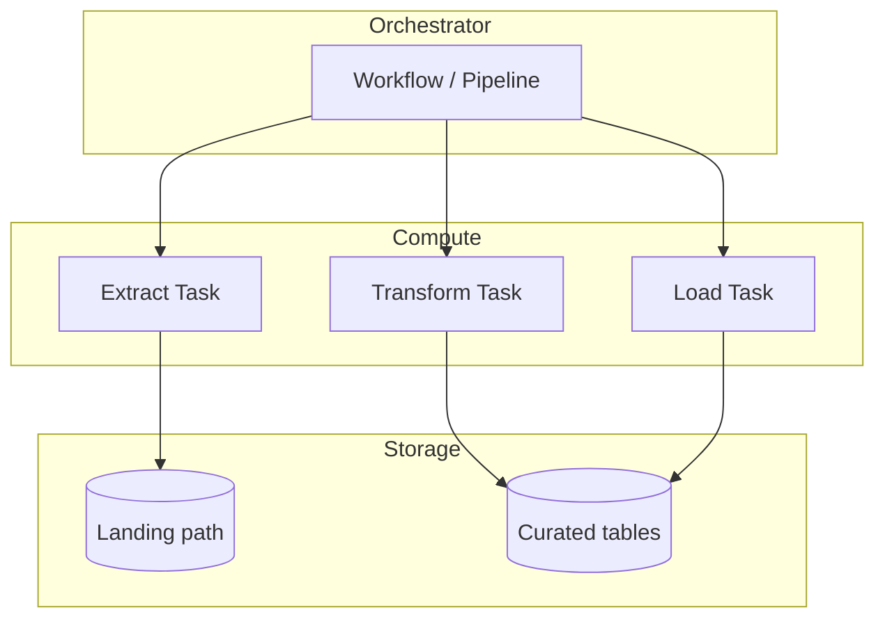

# daily-medallion-orders-component

**Kind:** `component` · **Language:** `mermaid`

component diagram for workflow /workflows/daily-medallion-orders.md

## Subjects

- [daily-medallion-orders](/workflows/daily-medallion-orders.md)

## Diagram

## Notes

_Edit the fenced listing above; keep language tag as mermaid or plantuml._
