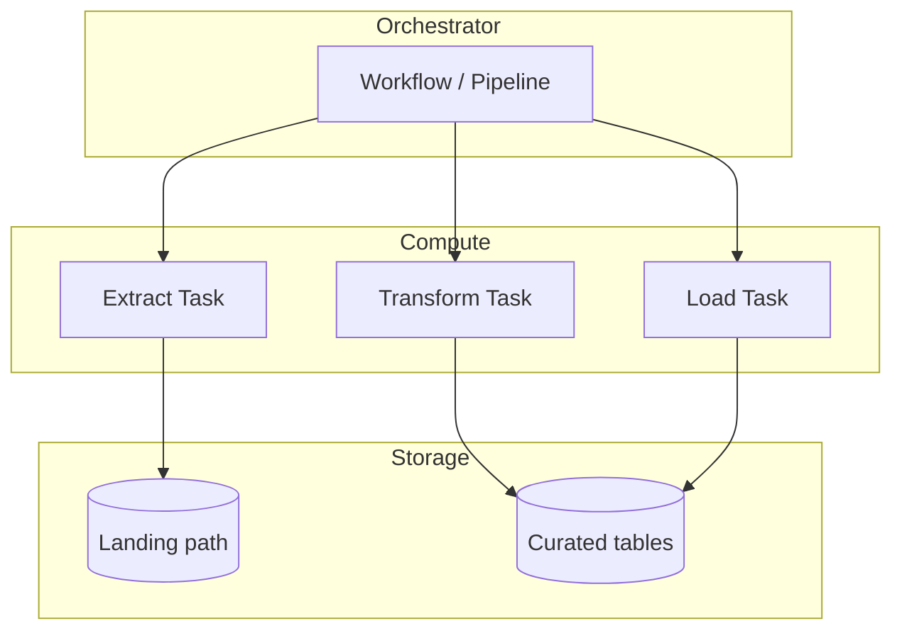

# orders-stream-landing-component

**Kind:** `component` · **Language:** `mermaid`

component diagram for ingestion job /ingestion/orders-stream-landing.md

## Subjects

- [orders-stream-landing](/ingestion/orders-stream-landing.md)

## Diagram

## Notes

_Edit the fenced listing above; keep language tag as `mermaid` or `plantuml`._
