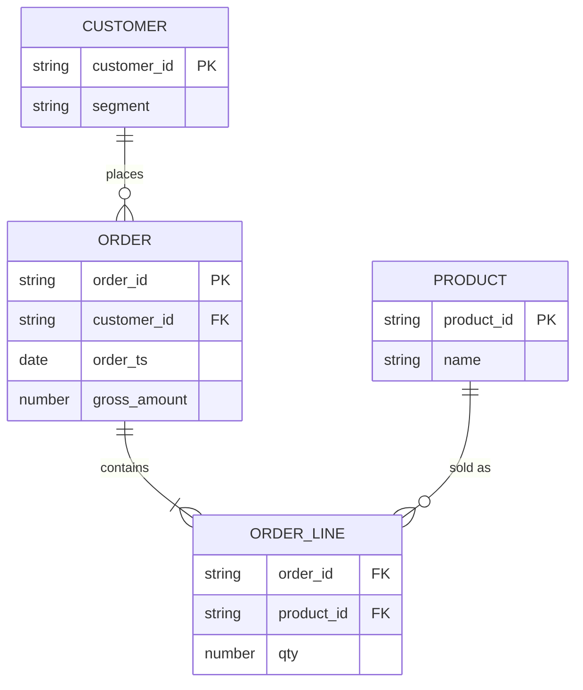

# Orders ERD

**Kind:** `erd` · **Language:** `mermaid`

Logical ERD for commerce orders

## Subjects

- [gold-order-daily](/tables/gold-order-daily.md)

## Diagram

## Notes

_Edit the fenced listing above; keep language tag as mermaid or plantuml._
