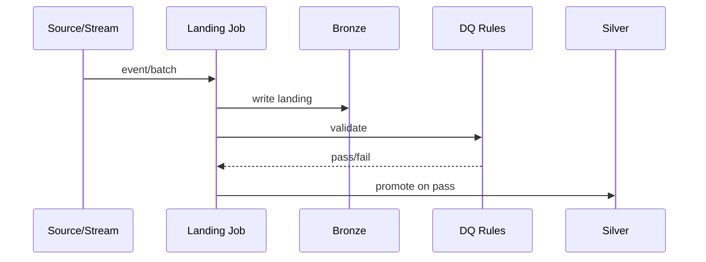

# orders-stream-landing-sequence

**Kind:** `sequence` · **Language:** `mermaid`

sequence diagram for ingestion job /ingestion/orders-stream-landing.md

## Subjects

- [orders-stream-landing](/ingestion/orders-stream-landing.md)

## Diagram

## Notes

_Edit the fenced listing above; keep language tag as `mermaid` or `plantuml`._
