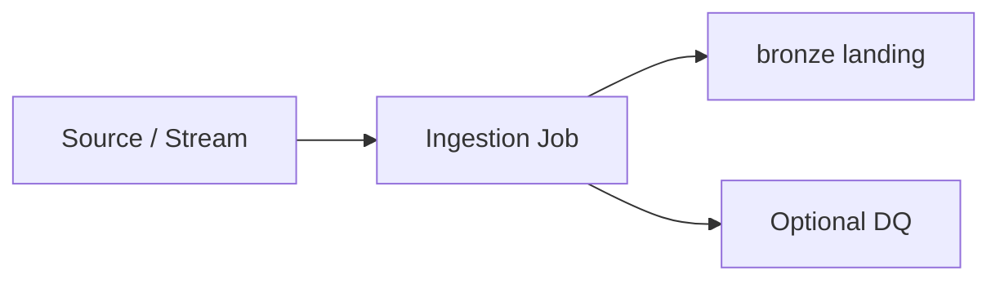

# orders-stream-landing

Lands order events from Event Hubs into bronze Delta

**Mode:** `streaming` · **Pattern:** `stream-to-bronze` · **Target layer:** `bronze`

**Orchestrator:** fabric-pipeline
**Connector:** eventhubs
**Formats:** json → delta
**Checkpoint:** `checkpoints/orders-stream`
**Idempotent:** True
**SLA:** 15.0 minutes

## Sources

- Stream: /streams/orders-events.md

## Lands as (tables)

- /tables/bronze-orders-raw.md

## Storage

- /storage/bronze-orders-prefix.md

## Steps

1. Read Event Hub
2. Write bronze Delta
3. Update watermark

## Ingestion flow

