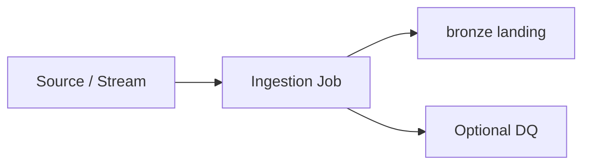

# product-catalog-sftp-load

Nightly full extract of product catalog from SFTP to bronze

**Mode:** `file_drop` · **Pattern:** `sftp-to-bronze` · **Target layer:** `bronze`

**Orchestrator:** adf
**Schedule:** `0 2 * * *`
**Connector:** sftp-products
**Formats:** csv → delta
**Idempotent:** True

## Sources

- Source: /sources/product-catalog-sftp.md

## Steps

1. List SFTP files
2. Copy to landing
3. Register bronze table

## Ingestion flow

