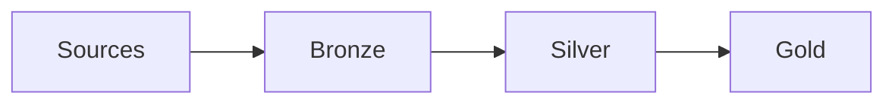

# Retail Commerce Lake

Primary commerce lakehouse

**Platform:** fabric-onelake

**URI:** `abfss://lake@onelake/retail`

## Layers

- [bronze](/layers/bronze.md)
- [silver](/layers/silver.md)
- [gold](/layers/gold.md)

## Architecture

