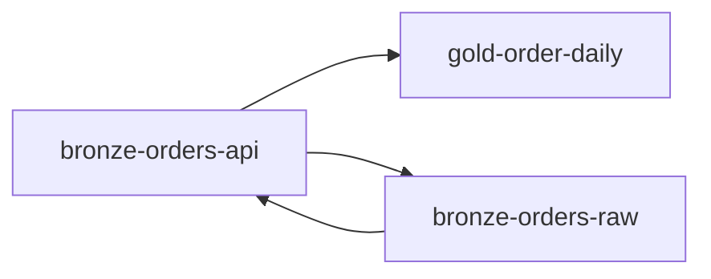

# Context pack: gold-order-daily

Hops: 2 · Nodes: 4

## order_daily (`Table`, gold)

- Path: `/tables/gold-order-daily.md`
- Inferred table from gold/marts/order_daily.sql

**Layer:** gold  
Inferred table from gold/marts/order_daily.sql
```sql
CREATE OR REPLACE TABLE gold.order_daily AS
SELECT
  CAST(order_ts AS DATE) AS order_date,
  currency,
  COUNT(*) AS order_count,
  SUM(gross_amount) AS gross_revenue
FROM silver.orders
GROUP BY 1, 2;
```

## orders_api (`Table`, bronze)

- Path: `/tables/bronze-orders-api.md`
- Referenced by orders_raw

**Layer:** bronze  
Referenced by orders_raw

## customer_ltv (`View`, gold)

- Path: `/views/gold-customer-ltv.md`
- Per-customer lifetime value view

Per-customer lifetime value view
```sql
SELECT customer_id, SUM(gross_amount) lifetime_value, COUNT(*) order_count FROM silver.orders GROUP BY customer_id
```
- [silver-orders](/tables/silver-orders.md)

## orders_raw (`Table`, bronze)

- Path: `/tables/bronze-orders-raw.md`
- Inferred table from bronze/sales/orders_raw.sql

**Layer:** bronze  
Inferred table from bronze/sales/orders_raw.sql
```sql
CREATE OR REPLACE TABLE bronze.orders_raw AS
SELECT * FROM landing.orders_api;
```

## Lineage diagram


