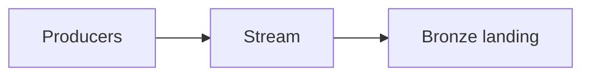

# orders-events

Order placement events

**Platform:** eventhubs  
**URI:** `endpoints://eventhubs/orders`  
**Format:** json

**Lands as:** /tables/bronze-orders-raw.md

```mermaid
flowchart LR
  P[Producers] --> S[Stream] --> B[Bronze landing]
```
